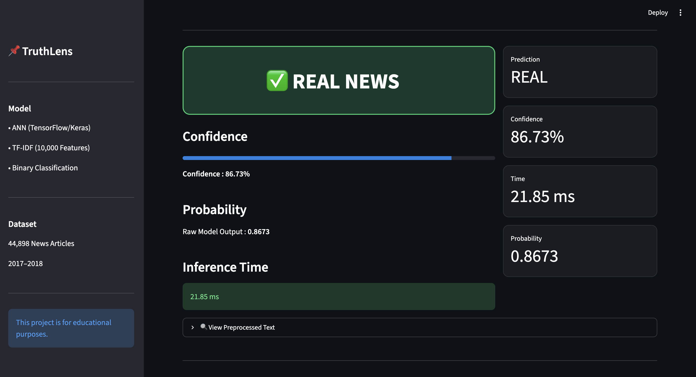

# 🔍 TruthLens — AI Fake News Detector

<div align="center">


[]([YOUR_RENDER_LINK_HERE](https://fake-news-detection-system-jt8g.onrender.com/))
[](https://github.com/sourabh9098/Fake-News-Detection-System)
[](https://python.org)
[](https://keras.io)
[](https://streamlit.io)

**An end-to-end deep learning project that detects fake news using an Artificial Neural Network trained on 44898 real -world news articles**

[LinkedIn](https://linkedin.com/in/sourabh9098)

</div>

---

## 📸 Screenshots

<div align="center">

### Home Page


</div>

---

## What This Project Does

TruthLens takes any news article or headline as input and predicts whether it is **Real** or **Fake** using a trained ANN model — with a confidence percentage breakdown.

```
User pastes article
        ↓
   Text Cleaning
        ↓
 TF-IDF Vectorization
        ↓
   ANN Prediction
        ↓
  REAL ✅ or FAKE ❌
  + Confidence Score
```

---

## 🧠 The ML Pipeline

### Step 1 — Data Collection
| Source | Articles | Label |
|--------|----------|-------|
| Kaggle — `clmentbisaillon/fake-and-real-news-dataset` | 23,481 | Fake (0) |
| Kaggle — `clmentbisaillon/fake-and-real-news-dataset` | 21,417 | Real (1) |
| **Total** | **44,898** | — |

### Step 2 —> Data Cleaning
- Removed duplicate articles
- Lowercased all text
- Removed URL , punctuation , numbers
- Removed stopwords using  NLTK
- Removed source specific words (reuters , washington , etc.)

### Step 3 —> Feature Engineering
```python
TfidfVectorizer(max_features=10000)
# fit_transform on train only → no data leakage
# transform on test only
```

### Step 4 —> Model Architecture
```
Input Layer  →  10,000 TF-IDF features
     ↓
Dense(32)   →  ReLU 
     ↓
Dense(16)   →  ReLU + Dropout(0.2)
     ↓
Dense(1)     →  Sigmoid → probability (0 to 1)
```

### Step 5 — Training
| Parameter | Value |
|-----------|-------|
| Optimizer | Adam |
| Loss | Binary Crossentropy |
| Epochs | 2 |
| Batch Size | 32 |
| Train/Test Split | 80% / 20% |

### Step 6 — Results
| Metric | Score |
|--------|-------|
| Train Accuracy | 99% |
| Test Accuracy | 99% |
| Precision | 0.99 |
| Recall | 0.99 |
| F1 Score | 0.99 |

---

## ⚠️ Data Leakage — Honest Disclosure

During evaluation, I discovered a **data leakage issue** in this dataset

Real news articles consistently started with location patterns like :
```
"WASHINGTON (Reuters) — ..."
```

The model was learning to detect the **news source** (Reuters byline)
rather than the actual **content quality** — which artificially inflated accuracy-

**What I did:-**
- Identified the top TF-IDF coefficients → `reuters` had coef: 27.594 (highest of all words)
- Attempted to remove source -  specific patterns and words
- Retrained and compared models before and after fix
- Documented the limitation honestly

**Why this matters:**
Understanding and communicating model limitations is a core data science skill
This dataset is widely known to have this issue  — even professional platforms
acknowledge it . The project still demonstrates the complete ML pipeline effectively

---

## 🛠 Tech Stack

| Category | Technology |
|----------|-----------|
| Language | Python 3.11 |
| Deep Learning | Keras / TensorFlow |
| NLP | NLTK , TF-IDF ( Scikit-learn) |
| Data Processing | Pandas, NumPy |
| Visualization | Matplotlib , Seaborn |
| Web App | Streamlit |
| Deployment | Render |
| Model Saving | Keras (.keras), Joblib (.pkl) |

---

## 📁 Project Structure

```
truthlens/
│
├── app.py                  ← Streamlit web application
├── ann_model.keras         ← Trained ANN model
├── tfidf_vectorizer.pkl    ← Fitted TF-IDF vectorizer
├── requirements.txt        ← Python dependencies
├── notebooks/
│   └── TruthLens.ipynb     ← Full EDA + training notebook
├── screenshots
└── README.md
```


**❌ Fake News Example**
```
SHOCKING: Scientists discover that 5G towers are being used by the
government to control minds. Share before it gets deleted!
Obama and Soros are funding this operation.
```

**✅ Real News Example**
```
The Federal Reserve raised interest rates by 25 basis points on
Wednesday, bringing borrowing costs to their highest level in 16 years.
Fed officials indicated they may pause further hikes to assess impact.
```

---

## 📊 What I Learned

- End - to -end NLP pipeline — from raw text to deployed model
- TF-IDF vectorization and its limitations vs word embeddings
- Importance of **fit on train, transform on test** to prevent leakage
- Identifying and documenting data quality issues professionally
- Deploying ML models on cloud platforms ( Render)

---

## 🔮 Future Improvements

- [ ] Replace TF-IDF with BERT embeddings for better generalization
- [ ] Add multi-language support
- [ ] Train on more recent and diverse news sources
- [ ] Add URL-based article scraping
- [ ] Implement LIME /SHAP for model explainability

---

## 👨‍💻 About

Built by **Sourabh** — CS student passionate about Data Science and ML


[](https://linkedin.com/in/sourabh9098)
[](https://github.com/sourabh9098)

---

<div align="center">

**⭐ Star this repo if you found it useful!**

*Built with ❤️ using Python · Keras · Streamlit · Render*

</div>
